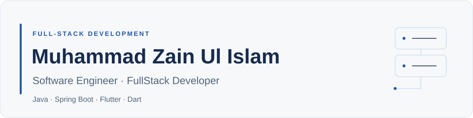

<picture>
  <source media="(prefers-color-scheme: dark)" srcset="./profile/header-dark.svg">
  <source media="(prefers-color-scheme: light)" srcset="./profile/header-light.svg">
  
</picture>

  Java &nbsp;·&nbsp; Spring Boot &nbsp;·&nbsp; Flutter &nbsp;·&nbsp; Dart

  Islamabad, Pakistan &nbsp;·&nbsp;
  <a href="mailto:zain.rebaso@gmail.com">Email</a> &nbsp;·&nbsp;
  <a href="https://www.linkedin.com/in/muhammad-zain-ul-islam-rebaso/">LinkedIn</a>

## About

I'm a software engineer and FullStack Developer building Java backends and Flutter frontends. I develop REST APIs and authentication flows with Spring Boot, Spring Security, and MySQL, and connect them to responsive interfaces built with Flutter and Dart.

My work includes e-commerce services, inventory and warehouse management, Kafka-based event processing, and frontend authentication workflows. I use feature-based Clean Architecture with MVVM-style presentation and Riverpod state management in Flutter. I care about clear module boundaries, reliable data handling, and code that is easy to maintain.

Currently, I'm developing **MightyCart**, an e-commerce platform, and expanding my experience in system design and distributed systems.

## Technical Skills

| Area | Technologies & Practices |
| :--- | :--- |
| Languages | Java, Dart, SQL, Python |
| Backend | Spring Boot, Spring MVC, Spring Data JPA, Hibernate, Flask |
| Frontend | Flutter, Riverpod, responsive UI, form validation |
| API Integration | Dio, authentication interceptors, automatic token refresh, secure token storage |
| Security | Spring Security, JWT, OAuth2, role-based access control, HMAC request validation |
| Data & Messaging | MySQL, Apache Kafka, Hazelcast |
| Storage | MinIO, S3-compatible object storage |
| Tools | Git, Docker, Maven, Postman |
| Engineering | REST API design, modular monoliths, event-driven patterns, AOP logging, feature-based Clean Architecture, MVVM-style presentation |

## Featured Projects

### MightyCart

**E-commerce platform · In development · Private repository**

A modular Spring Boot application for product, category, variant, pricing, inventory, and warehouse management.

- JWT authentication, email verification, and HMAC request validation.
- MinIO-backed product image storage through a custom storage abstraction.
- Kafka-based asynchronous processing and MySQL persistence with Spring Data JPA.
- Responsive Flutter frontend for registration, email OTP verification, login, and warehouse management.
- Riverpod state management and Dio API integration with automatic token refresh.
- Warehouse accordion cards with an internal bin scrollbar and backend pagination.

**Stack:** Java · Spring Boot · Spring Security · MySQL · Kafka · MinIO · Docker · Flutter · Dart · Riverpod · Dio

### [Secure Campus Management System](https://github.com/MuhammadZainUlIslam/secure-campus-management-system)

Backend for campus operations with access and refresh tokens, role- and permission-based authorization, HMAC request integrity, Hazelcast caching, and AOP-based request logging.

**Stack:** Java 21 · Spring Boot · Spring Security · Hibernate · MySQL · Hazelcast

### [Spring Security: JWT, OAuth2 & AOP](https://github.com/MuhammadZainUlIslam/spring-security-jwt-oauth2-aop)

Authentication project with JWT, Google and GitHub OAuth2 login, role-based access control, and AOP logging for request tracing.

**Stack:** Java · Spring Boot · Spring Security · OAuth2

### Kafka Library Events

A producer and consumer project exploring asynchronous event publishing and processing with Spring Kafka.

- **[Producer](https://github.com/MuhammadZainUlIslam/kafka-springboot-library-events):** REST endpoints, multiple producer approaches, and integration testing.
- **[Consumer](https://github.com/MuhammadZainUlIslam/library-events-consumer):** Event consumption, deserialization, error handling, and retry-aware processing.

**Stack:** Java · Spring Boot · Apache Kafka · Spring Kafka

## Experience

### 🟢 FullStack Developer — Rebaso Engineering

**Islamabad · July 2026 – Present**

- Developing a Spring Boot e-commerce platform with modular product, pricing, and inventory services.
- Implementing authentication and verification flows with Spring Security and JWT.
- Integrating MinIO object storage, Kafka-based processing, and MySQL persistence.
- Building responsive Flutter screens for registration, OTP verification, login, and warehouse management.
- Organizing frontend features with Clean Architecture and MVVM-style presentation using Riverpod.
- Integrating Spring Boot APIs through Dio, with authentication interceptors, secure token storage, automatic token refresh, and network error handling.
- Implementing form validation and warehouse bin navigation with accordion cards, internal scrolling, and backend pagination.
- Containerizing backend services with Docker.

### Java Intern · Evamp & Saanga

**Islamabad · December 2025 – June 2026**

- Developed REST APIs using Spring Boot and a controller–service–repository structure.
- Worked with MySQL, native queries, and third-party API integrations.
- Implemented JWT authentication with Spring Security.
- Practiced microservices-based application design.

### Project Lead · Intelligent Vehicle Parking System

**Final Year Project · In collaboration with Al-Qawi Steels**

- Built a CCTV-based vehicle detection system using Flask and OpenCV.
- Developed backend APIs for monitoring and operations.
- Led system design, UML modeling, documentation, and Figma UI design.

## Education

**BS Software Engineering**  
Foundation University Islamabad · 2020 – 2025

---

  Interested in full-stack development opportunities or collaboration? 
  <a href="mailto:zain.rebaso@gmail.com">Get in touch</a> ·
  <a href="https://www.linkedin.com/in/muhammad-zain-ul-islam-rebaso/">Connect on LinkedIn</a>

